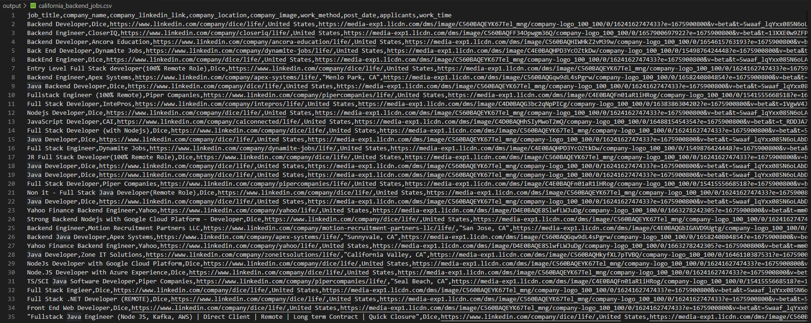
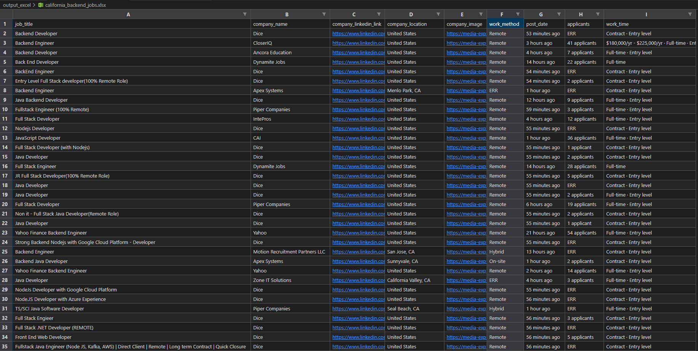
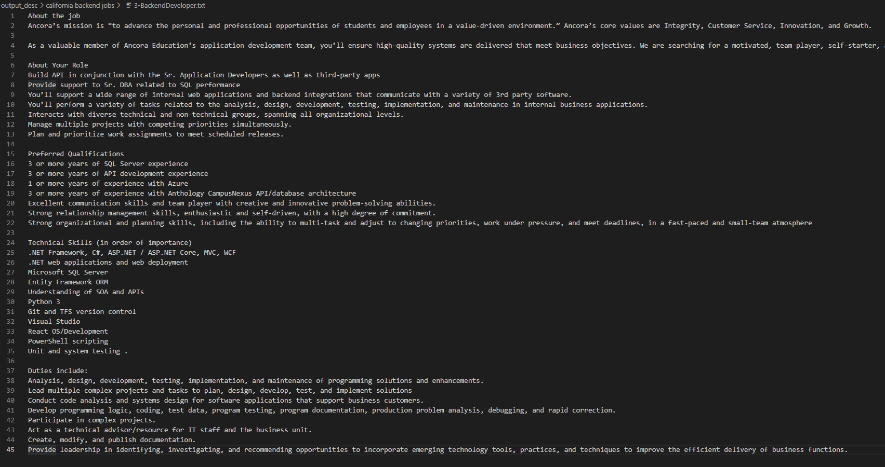

#   Web Scraper | Using Selenium in Scrapy (Python)

##  Scraping Linkedin Job Ads Data

### Received data :

*   job title => Title of the job posting.
*   company name => Is the name of the company.
*   company linkedin link => The link to the company's linkedin account.
*   company location => The location of the company (geography).
*   company image => The picture the company used on its linkedin account. The logo appears in corporate places.
*   work method => The job announcement informs you which working method to work according to.
*   post date => Date of publication of the job advertisement. if it is less than 24 hours, it can be given as an hour.
*   applicants => The number of people who applied for the job advertisement.
*   work time => It gives the level and working time of the person sought in the job advertisement.

**Important :** If there is no desired data on the Linkedin page, ERR prints the output. ERR informs us that this information has not been entered on linkedin.

### Saving the contents of job advertisements :

**output_desc :** The job vacancies in the folder are Decoded by search word and location. Job postings in these folders are named in a specific order. Text has been selected as the file format. It contains the explanations written about the job advertisements in it.

### Listing links to job ads :

**output_list :**  The link information for the job ads listed in this folder is printed to a txt file.In the code, Txt files were called, and the information in them was added to the generated python list. The link information in the list was used to visit the page and then pull data.

***

### A csv sample of a product from the received data :



***You can see all the outputs in the output folder.***

***

###  EXCEL output :



***

###  Description data of job ads saved in txt file :



***

##  Information about the developed code

### **settings.py** What I added to the file :

```python
DOWNLOADER_MIDDLEWARES = {
    'scrapy_selenium.SeleniumMiddleware': 800
}

from shutil import which

SELENIUM_DRIVER_NAME = 'chrome'
SELENIUM_DRIVER_EXECUTABLE_PATH = 'chromedriver.exe' # chromedriver.exe path
SELENIUM_DRIVER_ARGUMENTS=['-headless']  # '--headless' if using chrome instead of firefox
```

**Important :** To be able to use selenium, please cromedriver.download the exe and do not forget to enter the path to the settings. [chromedriver.exe install](https://chromedriver.chromium.org/downloads)

### **linkedin_search.py :** 
1. He can log in via Linkedin and enter job vacancies.
2. You can search job ads by specifying keywords and location, and filtering can be applied.
3. The link information of the listed job vacancies is taken and saved in a txt file. This process continues until you get to the last page and the last job posting.

### **linkedin_details.py :** 
1. Log in to your Linkedin account.
2. Imports the txt file containing the job vacancies and converts it into a python list.
3. The links of the job advertisements are taken and the data on the page is collected.
4. The description made in the job posting is saved in a separate txt file.

### **The code for logging in to your Linkedin account :**

```python
driver.get("https://www.linkedin.com/login/tr?trk=homepage-basic_intl-segments-login")

username = driver.find_element(By.XPATH,'//*[@id="username"]')
username.send_keys('') # linkedin username or e-mail
password = driver.find_element(By.XPATH,'//*[@id="password"]')
password.send_keys('') # linkedin password
loginButton = driver.find_element(By.XPATH,'//*[@id="organic-div"]/form/div[3]/button')
loginButton.click()
```

### **Entering the Linkedin job search page; keyword, location and filtering operations to decipher :**

```python
driver.get("https://www.linkedin.com/jobs/search/")

search = driver.find_element(By.XPATH, '//input[@class="jobs-search-box__text-input jobs-search-box__keyboard-text-input"]')
search.send_keys('') # keywords
city = driver.find_element(By.XPATH,'//input[@class="jobs-search-box__text-input"]')
city.clear()
city.send_keys('') # location
time.sleep(1)
driver.find_element(By.XPATH, '//button[text()="Search"]').click()
time.sleep(10)
getUrl = driver.current_url
fullUrl = getUrl + '' # The part added to the url after filtering. Two quotes will be added inside. 
driver.get(fullUrl)
```

### **Collecting the link information of job ads page by page and printing it to a txt file :**

```python
isNextDisabled = False
iNumber = 1
while not isNextDisabled:
    blocks = driver.find_elements(By.XPATH,'//ul[@class="scaffold-layout__list-container"]/li')
    
    for block in blocks:
        link = block.find_element(By.XPATH, './/div/div[1]/div[1]/div[1]/a').get_attribute("href")
        # Toplanan linklerin yazdırılacak adresi :
        with open(f'output_list/{top_link_names}.txt', 'a',encoding="utf-8") as f:
            f.write(link + " , ")
        driver.execute_script("arguments[0].scrollIntoView();", block)
    iNumber = iNumber + 1
    iNumberSayac = driver.find_element(By.XPATH,'//ul[@class="artdeco-pagination__pages artdeco-pagination__pages--number"]/li[last()]/button/span').text
    
    try:
        nextPage = driver.find_element(By.XPATH,f'//ul[@class="artdeco-pagination__pages artdeco-pagination__pages--number"]/li[@data-test-pagination-page-btn="{iNumber}"]/button')
    except:
        nextPage = driver.find_element(By.XPATH,'//ul[@class="artdeco-pagination__pages artdeco-pagination__pages--number"]/li[not(@data-test-pagination-page-btn)][last()]/button')
            
    if iNumber > int(iNumberSayac):
        isNextDisabled = True
        print(f"Sayaç çalıştı :) => {iNumberSayac}")
    else:
        nextPage.click()
        WebDriverWait(driver, 10)
```

### **Reading the txt file created from the links of job ads :**

```python
with open(f'output_list/{top_link_names}.txt', 'r',encoding="utf-8") as f:
    data = f.read()
    listem = data.split(",")
```

### **Visiting links in a txt file one by one and collecting data on the page :**

```python
txtNumbers = 1
for job in listem:
    driver.get(job)
    time.sleep(2)
    try:
        job_title = driver.find_element(By.XPATH, '//h1[@class="t-24 t-bold jobs-unified-top-card__job-title"]').text
    except:
        job_title = 'ERR'
    try:
        company_name = driver.find_element(By.XPATH, '//a[@class="ember-view t-black t-normal"]').text
    except:
        company_name = 'ERR'
    try:
        company_linkedin_link = driver.find_element(By.XPATH, '//a[@class="ember-view t-black t-normal"]').get_attribute("href")
    except:
        company_linkedin_link = 'ERR'
    try:
        company_location = driver.find_element(By.XPATH, '//span[@class="jobs-unified-top-card__subtitle-primary-grouping t-black"]/span[@class="jobs-unified-top-card__bullet"]').text
    except:
        company_location = 'ERR'
    try:
        company_image = driver.find_element(By.XPATH, '//img[@class="lazy-image ember-view EntityPhoto-square-3 mb3"]').get_attribute("src")
    except:
        company_image = 'ERR'
    try:
        work_method = driver.find_element(By.XPATH, '//span[@class="jobs-unified-top-card__workplace-type"]').text
    except:
        work_method = 'ERR'
    try:
        post_date = driver.find_element(By.XPATH, '//span[@class="jobs-unified-top-card__subtitle-secondary-grouping t-black--light"]/span[1]').text
    except:
        post_date = 'ERR'
    try:
        applicants = driver.find_element(By.XPATH, '//span[@class="jobs-unified-top-card__subtitle-secondary-grouping t-black--light"]/span[2]/span').text
    except:
        applicants = 'ERR'
    try:
        work_time = driver.find_element(By.XPATH, '//li[@class="jobs-unified-top-card__job-insight"][1]/span').text
    except:
        work_time = 'ERR'
    try:
        driver.find_element(By.XPATH, '//button[@aria-label="Click to see more description"]').click()
        new_str = ''.join(letter for letter in job_title if letter.isalnum())
        job_desc = driver.find_element(By.XPATH, '//div[@id="job-details"]').text
        # Job desc. yazıdırlacağı adres:
        with open(f'output_desc/{desc_folder_name}/{txtNumbers}-{new_str}.txt', 'w',encoding="utf-8") as f:
            f.write(job_desc)
        txtNumbers = txtNumbers + 1
    except:
        job_desc = "None Description"
        new_str = ''.join(letter for letter in job_title if letter.isalnum())
        # Job desc. yazıdırlacağı adres:
        with open(f'output_desc/{desc_folder_name}/{txtNumbers}-{new_str}.txt', 'w',encoding="utf-8") as f:
            f.write(job_desc)
        txtNumbers = txtNumbers + 1
    
    yield {
        'job_title':job_title,
        'company_name' : company_name,
        'company_linkedin_link' : company_linkedin_link,
        'company_location' : company_location,
        'company_image' : company_image,
        'work_method' : work_method,
        'post_date' : post_date,
        'applicants' : applicants,
        'work_time' : work_time
        }
```
### **Running the developed code in the terminal :**
*   Executes the code but does not save the output.
```cmd
    sracpy crawl linkedin_search
    sracpy crawl linkedin_details
```

*   To save the output :
    *   csv save :
    ```cmd
        scrapy crawl amazon_search -o test.csv
    ```
    *   json save :
    ```cmd
        scrapy crawl amazon_search -o test.json
    ```
    *   xml save :
    ```cmd
        scrapy crawl amazon_search -o test.xml
    ```

***

##  Source

*   The documentation (including installation and usage) can be found at: [Scrapy official site](https://docs.scrapy.org/en/latest/)

